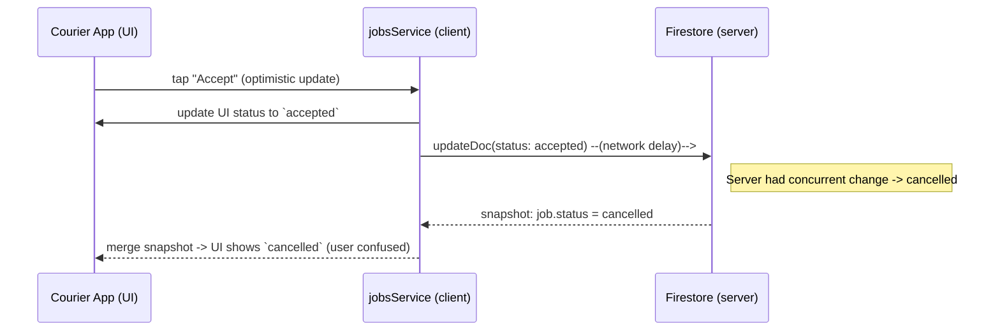
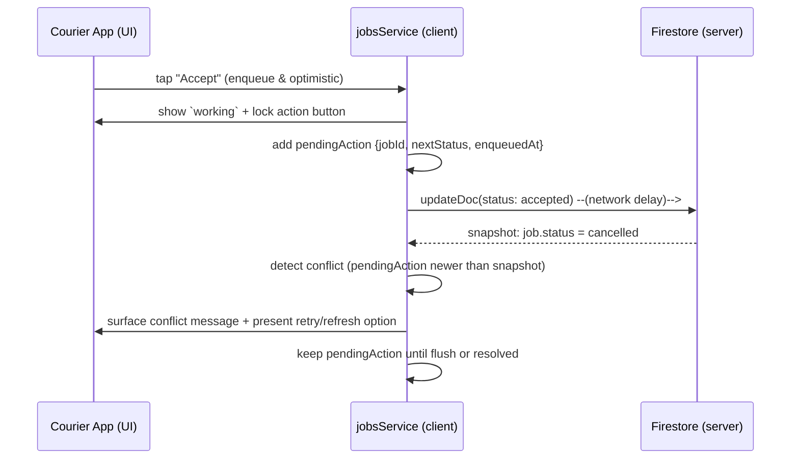

# Courier flow audit — smoke worktree

Date: 2026-02-12
Author: GitHub Copilot

Summary
- Purpose: audit the courier job lifecycle (assignment → accepted → pickup → delivered), identify root causes for observed issues (status jumps, jobs being cancelled unexpectedly, preview/route UX problems, listener/sync drift), and propose prioritized fixes with acceptance criteria and implementation plan.
- Deliverables in this PR: audit findings, Mermaid sequence diagrams (current vs proposed), small prototype UI suggestions, test skeletons, and a concrete TODO list for follow‑up code fixes.

Key observed problems
1. Status jumping: jobs sometimes move from `accepted` directly to `delivered` (or to `picked_up` → `delivered`) without clear user action.
2. Jobs being cancelled unexpectedly when courier tries to accept/preview (apparent race between client optimistic update and server listener reconciling a concurrent update).
3. Preview UX: while previewing job route, the UI may inadvertently trigger status/route recalculation side‑effects that look like state changes.
4. Listener/sync drift: realtime listeners occasionally re-order jobs or re-assign based on stale user identifiers (auth UID drift) — dev-only mitigation exists but the root cause needs clearer handling.

Hypotheses / likely root causes
- Optimistic local updates + queued status flush can race with server-side transactions causing inconsistent client state when offline/poor connectivity.
- Missing idempotency checks or weak validation in UI action handlers allow repeated or duplicate status commands to be sent.
- Snapshot merge logic may treat server updates as authoritative without reconciling in-flight client intent (no explicit causal ordering between local queued updates and incoming snapshots).
- Preview route code may trigger route refresh which mutates routeState and indirectly causes UI state transitions (not strictly a status change, but confuses users).

Acceptance criteria (for fixes)
- State transitions must obey `jobTransitionRules.canTransitionJobStatus` on both client and server; any invalid transition is rejected with user-facing message.
- While a status update is in-flight (optimistic or queued), the UI shows a pending spinner and prevents duplicate actions for the same job.
- Snapshot merges should not overwrite in‑flight local intent; local queued updates are reconciled by tracking `lastActionId` or `enqueuedAt` metadata.
- Previewing a job must not change job status or assignment; route preview must be read‑only.
- Add integration tests covering (a) offline accept → queued flush → server commit, (b) concurrent accept vs server-assigned cancel, (c) preview does not change status.

Proposed fixes (priority order)
1. Enforce idempotency & action-locks in UI handlers (small, high impact)
   - Disable action buttons while update is in-flight and show explicit `working` state.
   - Add guard in `jobsService.updateJobStatus` to dedupe identical repeated requests for same job/session.

2. Track in‑flight local intent and reconcile snapshots
   - Store lightweight `pendingActions` map in `jobsService` keyed by `jobId` → {nextStatus, enqueuedAt}.
   - When processing incoming snapshots, prefer local `pendingActions` if `enqueuedAt` is newer than `snapshot.updatedAt`.

3. Harden merge logic to avoid overwriting local queued updates
   - Update `mergeAssignedAndPendingDocs()` and listener handlers to reconcile instead of blind replace.

4. Make preview UI read‑only
   - Ensure preview buttons and map interactions do not call `updateJobStatus` or mutate assignment state.

5. Add integration tests + telemetry
   - Emulator tests for queued flush + concurrent update conflict.
   - Add telemetry (analytics.track) events for `queued_update_enqueued`, `queued_update_flushed`, `conflict_detected`.

Sequence diagrams (current vs proposed)

Current (problematic) flow:

Proposed flow (reconciled, preferred):

Implementation plan (tasks)
- [ ] Add `pendingActions` tracking to `jobsService` and reconcile snapshots. (jobsService)
- [ ] Add UI guards to JobDetailScreen / MapShellScreen to disable duplicate actions while busy. (UI)
- [ ] Add unit tests for `pendingActions` reconciliation and `canTransitionJobStatus` enforcement. (tests)
- [ ] Add emulator integration tests for queued flush + concurrent conflict. (integration tests)
- [ ] Add analytics events for queued + conflict telemetry. (telemetry)

Low-risk quick wins (I can implement in this PR)
- Add UI action-disable guards (small changes to `MapShellScreen` and `JobDetailScreen`).
- Add test skeletons for the more complex fixes and a detailed audit + Mermaid diagrams (this PR).

Files added in this PR
- `apps/V1-senderr-ios/docs/courier-flow-audit.md` (this file)
- `apps/V1-senderr-ios/src/services/__tests__/courierFlow.integration.test.ts` (test skeleton)

Next PR (follow‑ups)
- Implement `pendingActions` reconciliation + unit/integration tests (high priority)
- Fix any rule/server-side validation mismatches (may require Firestore rules changes)

Estimated effort
- Audit + diagrams + small UI guards: 1–2 days
- Full implementation + tests + CI vetting: 3–5 days (depending on concurrency edge cases)

---

If you want, I can now:
- open this audit PR (I will), and
- optionally implement the quick UI guards in the same PR (recommended).

Tell me if you want the quick UI guard changes included in this PR or done in a second PR.